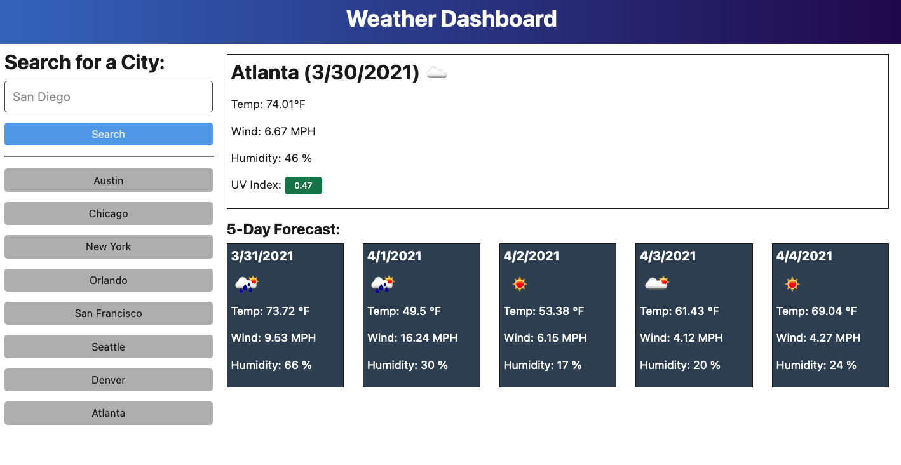

# Real Time Weather

## Description 
Real Time Weather is a weather dashboard that will run in the browser and feature dynamically updated HTML and CSS using JavaScript with a third party API https://openweathermap.org/api/one-call-api

## Table of Contents
* [Installation](#installation)
* [Usage](#usage)
* [License](#license)
* [Contributing](#contributing)
* [Tests](#tests)
* [Questions](#questions)

## Installation 
The user should clone the repository from GitHub. Once updates are made you can commit any changes and deploy to github.

## Usage 
This application will allow users search for a city's current weather and five day forecast. This app also allows the user the click on past searched citys to look at their current weather again.

 Real Time Weather

https://github.com/chl850405/real-time-weather.git

https://chl850405.github.io/real-time-weather/

## License 
This project is not licensed

## Contributing 
Contributors should read the installation section. 

## Tests
There are no tests for this application. 

## Questions
If you have any questions about this projects, please contact me directly at christimarchetti@gmail.com. You can view more of my projects at https://github.com/chl850405.